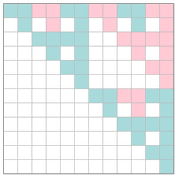
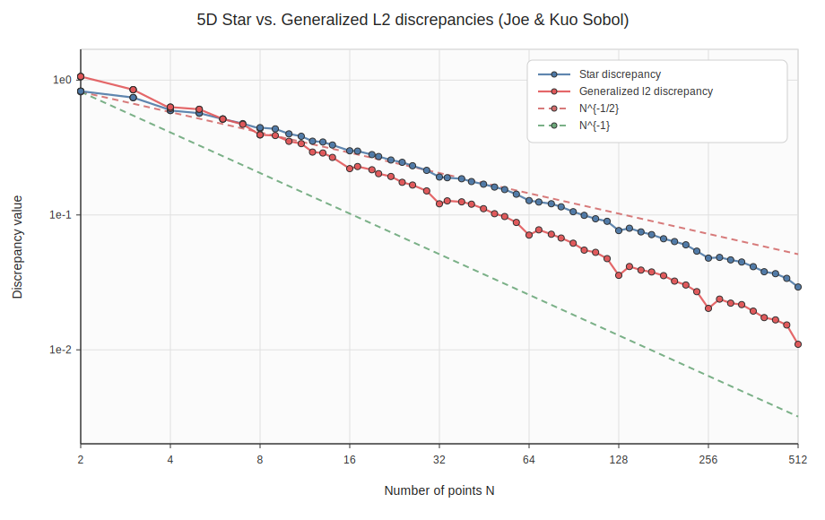
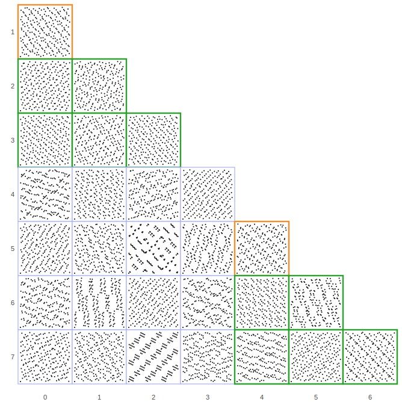

# tms_lib

`tms_lib` is a compact C++ library for constructing, manipulating, testing and visualizing digital `(t,m,s)`-nets and Sobol'-style low-discrepancy sequences over arbitrary Galois fields `GF(p^r)`.

It provides finite-field arithmetic, matrix utilities, Sobol' generator matrices, hardcoded direction-number tables, t-value computations, discrepancy estimators, SVG visualizations, and optional CUDA acceleration for expensive discrepancy computations.

👉 **Full documentation:** <https://nbonneel.github.io/tms_lib/>

---

## Highlights

- Digital nets and sequences over any `GF(p^r)`.
- Sobol' generator matrices in several variants:
  - classical Sobol' sequences,
  - Joe--Kuo tables,
  - Faure--Lemieux IS-dec tables,
  - OneTwo sequence tables,
  - QuadQuad sequence tables over `GF(3)`.
- Matrix operations over finite fields:
  - rank,
  - determinant tests,
  - inverses,
  - tensor products,
  - Pascal / translated Pascal matrices.
- t-value routines for digital nets and sequences.
- Exact / exhaustive checks for selected `t=0` properties.
- Point generation with optional Owen-style scrambling.
- Generalized L2 discrepancy and star discrepancy.
- Optional CUDA implementations for generalized L2 discrepancy and star discrepancy.
- SVG outputs for matrices, 2D point sets, discrepancy curves and 2D projection grids.

---

## Gallery

The demo program produces SVG figures such as the following.

<table>
<tr>
<td width="50%">
<strong>2D point set</strong><br>

</td>
<td width="50%">
<strong>Generator matrix</strong><br>

</td>
</tr>
<tr>
<td width="50%">
<strong>Discrepancy curves</strong><br>

</td>
<td width="50%">
<strong>2D projections</strong><br>

</td>
</tr>
</table>

---

## Quick start

```cpp
#include "tms_lib.h"

int main() {
    typedef Field<2, 1> F2;

    const int matrix_size = 32;
    const int dim = 10;

    SobolMatrix<F2> S(SOBOL_ONETWO_SEQ_GF2, dim, matrix_size);

    std::vector<MatrixView<F2> > matrices;
    matrices.push_back(S.view());

    std::vector<double> points(1024);
    get_points<F2>(&matrices[0], 1, 1024, points.data());

    return 0;
}
```

For a more complete example, see `main.cpp`.

---

## Build instructions

`tms_lib` uses CMake and builds a static library `tms_lib` plus a demo executable `tms_demo`.

### CPU build

```bash
git clone https://github.com/nbonneel/tms_lib.git
cd tms_lib

cmake -S . -B build -DCMAKE_BUILD_TYPE=Release
cmake --build build --config Release
```

Run the demo:

```bash
./build/tms_demo
```

On Windows with Visual Studio, the executable may be under a configuration subdirectory:

```powershell
.\build\Release\tms_demo.exe
```

### OpenMP

OpenMP is enabled by default when available.

```bash
cmake -S . -B build -DTMS_USE_OPENMP=ON
cmake --build build --config Release
```

To disable OpenMP:

```bash
cmake -S . -B build -DTMS_USE_OPENMP=OFF
cmake --build build --config Release
```

### CUDA build

CUDA support is optional. It enables GPU implementations for the generalized L2 discrepancy and star discrepancy routines.

```bash
cmake -S . -B build-cuda \
  -DCMAKE_BUILD_TYPE=Release \
  -DTMS_USE_CUDA=ON \
  -DTMS_CUDA_ARCHITECTURES=75

cmake --build build-cuda --config Release
```

For a different GPU, set `TMS_CUDA_ARCHITECTURES` accordingly, for example:

```bash
-DTMS_CUDA_ARCHITECTURES="75;86;89"
```

### Main CMake options

| Option | Default | Description |
|---|---:|---|
| `TMS_USE_OPENMP` | `ON` | Enable OpenMP when available. |
| `TMS_USE_CUDA` | `OFF` | Compile CUDA kernels and define `TMS_USE_CUDA`. |
| `TMS_CUDA_ARCHITECTURES` | `75` | CUDA architecture list passed to CMake. |

---

## Documentation

The full API documentation is available here:

**<https://nbonneel.github.io/tms_lib/>**

It includes descriptions of the main classes and routines, including parameters, assumptions, computational complexity, memory behavior, and thread-safety notes.

---

## Main components

### Finite fields

`tms_lib` supports computations over `GF(p^r)` through lightweight field descriptors such as:

```cpp
typedef Field<2, 1> F2; // GF(2)
typedef Field<3, 1> F3; // GF(3)
typedef Field<2, 3> F8; // GF(2^3)
```

Prime fields use plain integers, while extension fields use compact table-based arithmetic.

### Matrices

The library uses two matrix types:

```cpp
Matrix<F>     // owning matrix
MatrixView<F> // non-owning matrix view
```

The matrix layer provides finite-field rank, determinant checks, inverse computation, tensor products, Pascal matrices, and SVG export.

### Sobol' and related sequences

Generator matrices can be constructed from hardcoded tables:

```cpp
SobolMatrix<F2> S0(SOBOL_JOE_KUO_GF2, 10, 32);
SobolMatrix<F2> S1(SOBOL_ONETWO_SEQ_GF2, 10, 32);
SobolMatrix<F2> S2(SOBOL_FAURE_LEMIEUX_IS_DEC_GF2, 10, 32);

typedef Field<3, 1> F3;
SobolMatrix<F3> S3(SOBOL_QUADQUAD_GF3, 10, 32);
```

### t-values and discrepancy

`tms_lib` includes routines for computing t-values of digital nets/sequences and measuring point-set quality:

```cpp
std::vector<int> t = t_values<F>(matrices, dim, max_m);

double d_l2 = generalized_l2_discrepancy(points.data(), n_pts, dim);
double d_star = star_discrepancy(points.data(), n_pts, dim);
```

When built with CUDA, discrepancy routines can use GPU implementations for larger point sets.

---

## References

The implemented methods and hardcoded tables are related to the following works.

- I. M. Sobol'. *On the distribution of points in a cube and the approximate evaluation of integrals*. USSR Computational Mathematics and Mathematical Physics, 1967.
- S. Joe and F. Y. Kuo. *Remark on Algorithm 659: Implementing Sobol's quasirandom sequence generator*. ACM Transactions on Mathematical Software, 2003. <http://doi.acm.org/10.1145/641876.641879>
- S. Joe and F. Y. Kuo. *Constructing Sobol sequences with better two-dimensional projections*. SIAM Journal on Scientific Computing, 2008. <http://dx.doi.org/10.1137/070709359>
- F. Y. Kuo. *Sobol sequence direction numbers*. <https://web.maths.unsw.edu.au/~fkuo/sobol/>
- H. Faure and C. Lemieux. *Generalized Halton sequences in 2008: A comparative study*. ACM Transactions on Modeling and Computer Simulation, 2009. Implementation tables discussed in later IS-dec material. <https://arxiv.org/abs/1910.04084>
- N. Bonneel, A. Keller, D. Coeurjolly and V. Ostromoukhov. *Sobol' Sequences with Guaranteed-Quality 2D Projections*. ACM Transactions on Graphics, SIGGRAPH 2025. <https://perso.liris.cnrs.fr/nicolas.bonneel/paper_sobol.pdf>
- V. Ostromoukhov, N. Bonneel, D. Coeurjolly and J.-C. Iehl. *Quad-Optimized Low-Discrepancy Sequences*. SIGGRAPH Conference Papers, 2024. <https://perso.liris.cnrs.fr/nicolas.bonneel/paper_quad.pdf>
- P. Marion, M. Godin and P. L'Ecuyer. *An algorithm to compute the t-value of a digital net and of its projections*. Journal of Computational and Applied Mathematics, 2020. <https://www.sciencedirect.com/science/article/pii/S0377042719306740>

---

## Authorship

`tms_lib` was vibe-coded by Nicolas Bonneel with ChatGPT (**GPT-5.5 Thinking**), then manually adapted, reviewed, tested and released by Nicolas Bonneel.

